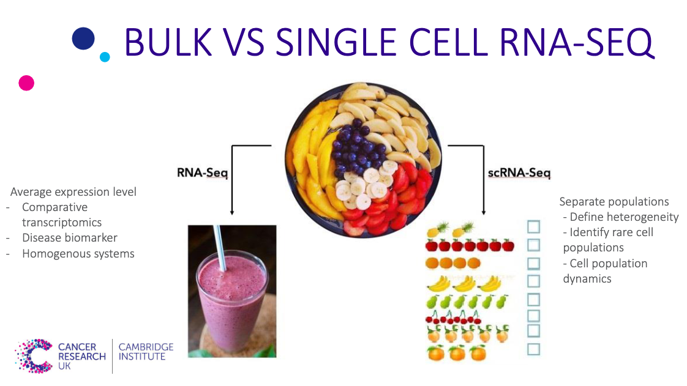

RNA-seq (RNA-sequencing) is a technique that can examine the quantity and sequences of RNA in a sample using next-generation sequencing (NGS). Compared to previous Sanger sequencing- and microarray-based methods, RNA-Seq provides far higher coverage and greater resolution of the dynamic nature of the transcriptome. Beyond quantifying gene expression, the data generated by RNA-Seq facilitate the discovery of novel transcripts, identification of alternatively spliced genes, and detection of allele-specific expression.

> We will refer to RNA-seq from now on by bulk RNA-seq to distinguish it from single-cell RNA-seq, which will be introduced later in this episode. 
{: .callout}

In order to perform bulk RNA-seq studies, samples have to be lysed, and the RNA is extracted. The following steps involve converting a sample of RNA to a cDNA library, which is then sequenced and mapped against a reference genome. The original goal of RNA sequencing was to compare the actual transcript abundance between samples.

> ### Question
> 
> What is a cDNA library prepration, and why it is used in the bulk RNA-seq?
> 
> > ### Solution
> > 
> > RNA is reverse transcribed to cDNA because DNA is more stable and to allow for amplification (which uses DNA polymerases) and leverage more mature DNA sequencing technology. While direct sequencing of RNA molecules is possible, most RNA-Seq experiments are carried out on instruments that sequence DNA molecules due to the technical maturity of commercial instruments designed for DNA-based sequencing. Therefore, cDNA library preparation from RNA is a required step for RNA-Seq. Each cDNA in an RNA-Seq library is composed of a cDNA insert of certain size flanked by adapter sequences, as required for amplification and sequencing on a specific platform. 
> {: .solution}
{: .challenge}

### Pitfall of bulk RNA-seq
- Insufficient for studying heterogeneous systems, e.g. early development studies, complex tissues (brain)
- Does not provide insights into the stochastic nature of gene expression
Therefore, scRNA-seq was introduced to overcome the limitation of bulk RNA-seq. 

## Introduction to single-cell RNA-seq

The main difference between bulk and single-cell RNA-seq (scRNA-seq) is that each sequencing library represents a single cell, instead of a population of cells. Bulk sample analysis is just like putting a fruit salad into a blender - the taste is an average of all ingredients. Analyzing single cells is like tasting each individual piece of fruit to gain a much more nuanced understanding of the composition of the fruit salad Single cell genomics

### The advantages of using scRNA-seq

- It allows the measurement of the distribution of expression levels for each gene across a population of cells. 
- It also allows to study new biological questions in which cell-specific changes in transcriptome are important, e.g. cell type identification, heterogeneity of cell responses, stochasticity of gene expression, inference of gene regulatory networks across the cells.
- The main advantage of scRNA-seq is that the cellular resolution and the genome-wide scope make it possible to address intractable issues using other methods, e.g. bulk RNA-seq or single-cell RT-qPCR. 

However, to analyse scRNA-seq data, novel methods are required, and some of the underlying assumptions for the methods developed for bulk RNA-seq experiments are no longer valid. There are also many different protocols in use, e.g. SMART-seq2 (Picelli et al. 2013), CELL-seq (Hashimshony et al. 2012) and Drop-seq (Macosko et al. 2015), which adds to the complexity of analysing scRNA-seq. In the next episode, we will briefly explore the various experimental methods currently used for scRNA-seq.



