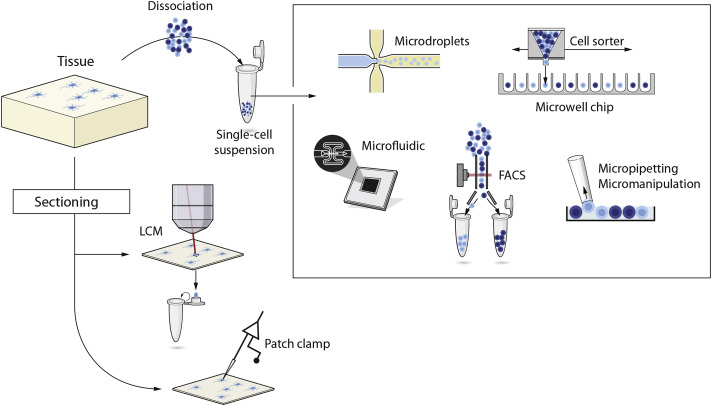

The strategy used for capture determines throughput, how the cells can be selected as well as what kind of additional information besides the sequencing that can be obtained. The three most widely used options are microwell-, microfluidic- and droplet- based.

There has been explosion in the field of scRNA-seq in the last 5 years. Development of new methods and protocols for scRNA-seq is currently a very active area of research, and several protocols have been published over the last few years.

Significant attention has to be paid to comparison of the results from different cells (sequencing libraries). The main sources of discrepancy between the libraries are:

- Amplification (up to 1 million fold)
- Gene ‘dropouts’ in which a gene is observed at a moderate expression level in one cell but is not detected in another cell (Kharchenko, Silberstein, and Scadden 2014)


